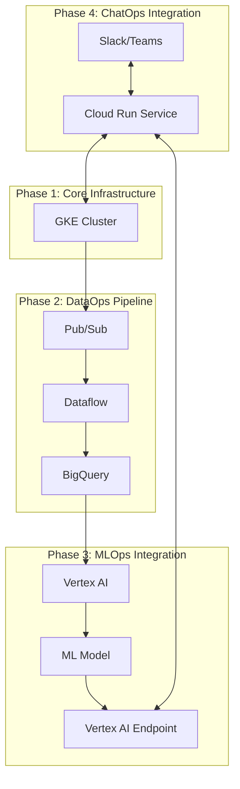

# Architecture and Design Diagram

This document provides a high-level overview of the AIOps platform's architecture. The diagram below illustrates the four phases of the project and how the different components interact.

## Architecture Diagram

## Diagram Explanation

The diagram is divided into the four phases of the project:

*   **Phase 1: Core Infrastructure:** The foundation of the platform is a Google Kubernetes Engine (GKE) cluster. This provides a scalable and resilient environment for running the other components of the platform.

*   **Phase 2: DataOps Pipeline:** This phase focuses on building a data pipeline to ingest, process, and store data. Data is ingested into **Pub/Sub**, processed in real-time by **Dataflow**, and then stored in **BigQuery** for analysis.

*   **Phase 3: MLOps Integration:** This phase integrates machine learning into the platform. Data from **BigQuery** is used to train machine learning models in **Vertex AI**. The trained models are then deployed as **Vertex AI Endpoints**.

*   **Phase 4: ChatOps Integration:** This phase provides a ChatOps interface for interacting with the platform. A **Cloud Run service** exposes a simple API that can be integrated with chat clients like **Slack** or **Microsoft Teams**. This allows users to interact with the GKE cluster and the Vertex AI endpoints from their chat client.

To view the rendered diagram, you can use a markdown viewer that supports the Mermaid syntax.
