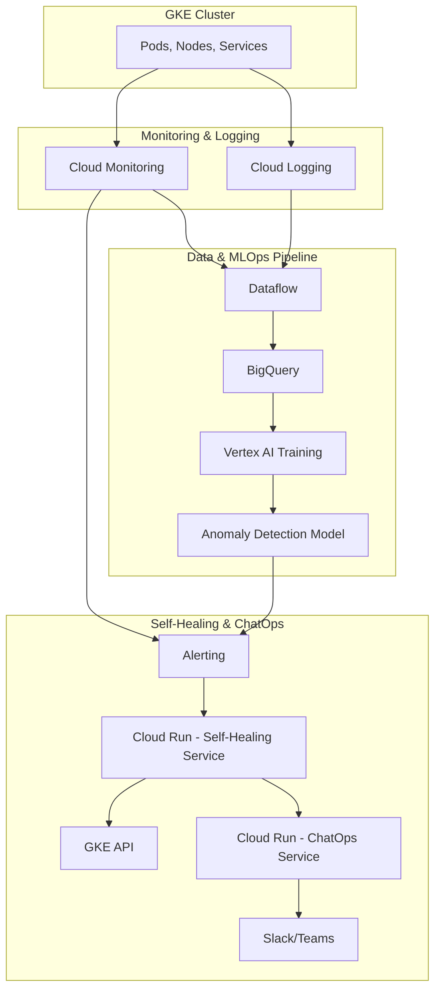

# GKE Monitoring and Self-Healing Use Case

This document outlines the architecture for a modular use case that monitors a GKE cluster, detects anomalies using an MLOps pipeline, and performs self-healing actions with ChatOps notifications.

## Architecture

### Explanation

1.  **Monitoring & Logging**: GKE metrics and logs are continuously collected by **Cloud Monitoring** and **Cloud Logging**.

2.  **Data & MLOps Pipeline**: The collected data is fed into the **Dataflow** and **BigQuery** pipeline. A **Vertex AI** training pipeline is then used to train an **Anomaly Detection Model** on this data.

3.  **Alerting & Self-Healing**: **Cloud Monitoring** is configured with an **alerting policy** that triggers when the Anomaly Detection Model identifies a critical issue. The alert invokes the **Cloud Run Self-Healing Service**.

4.  **Corrective Action**: The Self-Healing Service interacts with the **GKE API** to perform corrective actions, such as restarting pods or scaling deployments.

5.  **ChatOps Notification**: After taking action, the Self-Healing Service sends a notification to a **Slack or Teams** channel via the **ChatOps Service**, informing the team of the issue and the corrective action taken.

## Module Structure

This use case is organized into the following directories:

*   `terraform/`: Contains the Terraform code for any additional resources required for this use case, such as the alerting policy.
*   `src/anomaly_detection_model/`: Contains the source code and notebooks for the Vertex AI anomaly detection model.
*   `src/self_healing_service/`: Contains the source code for the Cloud Run service responsible for self-healing actions.
*   `chatops/`: Contains any specific ChatOps commands or integration code for this use case.
